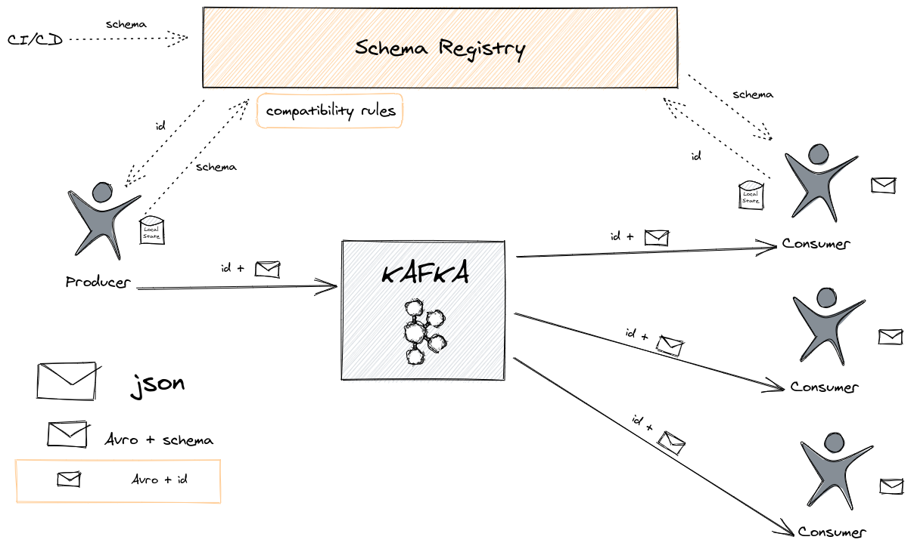

# Gentle (and practical) introduction to Apache Avro

*05 December 2020*

## Introduction

This post is a gentle introduction to [Apache Avro](https://avro.apache.org/). After several discussions with [Dario Cazas](https://github.com/dariocazas) about what's possible with [Apache Avro](https://avro.apache.org/), he did some research and summarize it in an email. I found myself looking for that email several times to forward it to different teams to clarify doubts about Avro. After a while, I thought it could be useful for others and this is how this series of three posts was born.

In summary, [Apache Avro](https://avro.apache.org/) is a binary format with the following characteristics:

- It's a binary what means it's very efficient (the keys of your data aren't copied several times as with JSON) but you can't read it in your text editor.
- It's a row format so each record is stored independently (for example, Parquet is a columnar format) so it's bad for aggregations but quite good to send data independently from one place to another.
- It has great support to manage the schema of the data. The schema is typically defined in JSON format.

These characteristics make [Apache Avro](https://avro.apache.org/) very popular in Event Streaming architectures based in [Apache Kafka](https://kafka.apache.org/) but it isn't the only possible use.

If you have more interest in [Apache Avro](https://avro.apache.org/), take a look to the [Apache Avro Wikipedia page](https://en.wikipedia.org/wiki/Apache_Avro).

## Avro with the Schema Registry and Kafka

[Apache Avro](https://avro.apache.org/) plays well with [Apache Kafka](https://kafka.apache.org/) because it provides good performance and an easy way to govern schemas. There is an important thing to note: because [Apache Avro](https://avro.apache.org/) is a binary format, consumers need to know how is the schema of the information stored in that message to deserialize it.

The most common way to do this is using the [Schema Registry](https://docs.confluent.io/platform/current/schema-registry/index.html), aka SR. We are going to speak about the Confluent implementation but it isn't the only one and it isn't part of the Kafka project. The workflow is quite simple: the producer consults the ID of the schema in the SR (or create a new one if it doesn't exist) and add that ID to the message. The consumer retrieves the schema from the SR using that ID and deserializes the message.

The way to add the ID to the message is also simple: one byte with the value `0` in the case of Confluent, 4 bytes with the ID and the rest of the data. It's documented in the [Wire Format](https://docs.confluent.io/platform/current/schema-registry/serdes-develop/index.html#wire-format) entry.



## Environment setup

Using the Confluent Avro serializer/deserializer, the process is quite straight-forward. Let's try it using the Confluent Community Docker version. The setup is documented in the [Quick Start for Apache Kafka using Confluent Platform Community Components (Docker)](https://docs.confluent.io/6.0.0/quickstart/cos-docker-quickstart.html) which it's summarized here:

```sh
git clone https://github.com/confluentinc/cp-all-in-one.git
cd cp-all-in-one/cp-all-in-one-community/
docker-compose up -d
```

Let's start creating a topic:

```sh
docker-compose exec broker kafka-topics \
  --create \
  --bootstrap-server localhost:9092 \
  --replication-factor 1 \
  --partitions 1 \
  --topic test
```

The output should be:

> Created topic test.

To test it, we are going to create a Kafka Producer and a Kafka Consumer.

## Kafka Producer with Confluent Schema Registry

Download the [kafka-java-client-examples](https://github.com/antonmry/kafka-java-client-examples) project and open it with your favourite IDE. We are going to work with a schema which it's located in the `src/main/resources` folder:

```json
{
 "namespace": "com.galiglobal.examples.testavro",
 "type": "record",
 "name": "Test",
 "fields": [
     {"name": "id", "type": "string"},
     {"name": "test", "type": "double"}
 ]
}
```

This Avro file is going to create a Test class you can use in your project.

**Note for IntelliJ Idea users**: you need to generate the classes from the Avro file.  Right-click on your project and choose `Maven` > `Generate sources and update folders`. It's important to do it each time you change the schema.

You can run now the `ConfluentProducerExample` and it should print:

> Successfully produced 10 messages to a topic called test

The more relevant parts are the properties of the producer:

```java
props.put(ProducerConfig.VALUE_SERIALIZER_CLASS_CONFIG, KafkaAvroSerializer.class);
props.put(AbstractKafkaSchemaSerDeConfig.SCHEMA_REGISTRY_URL_CONFIG, "http://localhost:8081");
```

We indicate how to connect to the SR and the serializer which it's publishing to the SR under the hood. In the class `io.confluent.kafka.schemaregistry.client.CachedSchemaRegistryClient` you can find the Rest client used to request schemas to the SR using http.

If you check in the SR, you can see the schema which has been created by the producer:

```sh
curl http://localhost:8081/subjects/test-value/versions/1
```

It should return:

```json
{
  "subject": "test-value",
  "version": 1,
  "id": 1,
  "schema": "{\"type\":\"record\",\"name\":\"Test\",\"namespace\":\"com.galiglobal.examples.testavro\",\"fields\":[{\"name\":\"id\",\"type\":\"string\"},{\"name\":\"test\",\"type\":\"double\"}]}"
}
```

## Kafka Consumer

We are going to consume the messages using the Kafka Consumer just executing the `ConfluentConsumerExample` class. It should print something similar to:

> key = id0, value = {"id": "id0", "amount": 1000.0}<br />
> key = id1, value = {"id": "id1", "amount": 1000.0}<br />
> key = id2, value = {"id": "id2", "amount": 1000.0}<br />
> key = id3, value = {"id": "id3", "amount": 1000.0}<br />
> key = id4, value = {"id": "id4", "amount": 1000.0}<br />
> key = id5, value = {"id": "id5", "amount": 1000.0}

The relevant part is again the configuration of the SR and the deserializer:

```java
props.put(ConsumerConfig.VALUE_DESERIALIZER_CLASS_CONFIG, KafkaAvroDeserializer.class);
props.put(AbstractKafkaSchemaSerDeConfig.SCHEMA_REGISTRY_URL_CONFIG, "http://localhost:8081");
props.put(KafkaAvroDeserializerConfig.SPECIFIC_AVRO_READER_CONFIG, true);
```

The schema url and deserializer are equivalent to the producer. `SPECIFIC_AVRO_READER_CONFIG` indicates we would like to deserialize to a Test object instead of a [GenericRecord](https://avro.apache.org/docs/1.8.2/api/java/org/apache/avro/generic/GenericRecord.html).

If we try to consume directly from the topic without use the Confluent deserializer, the result isn't quite legible:

```sh
docker-compose exec broker kafka-console-consumer \
 --topic test \
 --bootstrap-server localhost:9092 \
 --from-beginning \
 --property print.key=true \
 --property key.separator=" : " \
 --key-deserializer "org.apache.kafka.common.serialization.StringDeserializer" \
 --value-deserializer "org.apache.kafka.common.serialization.StringDeserializer"
```

As you can see, it's a binary protocol and quite efficient! We aren't sending the schema with every record as we would do with JSON or any other based protocol and that's a good saving.

## Schema Compatibility

Efficiency isn't the only positive point of this approach. One of the nice things you have with a Schema Registry is the possibility to govern schemas and make sure they are being used properly.

One of the big issues with asynchronous communications is how to evolve the schema without affect consumers of that particular topic. Schema Registry helps with that because it can check the changes in the schema and validate if they are breaking compatibility. They are different types of compatibility, you can read more on [Schema Evolution and Compatibility](https://docs.confluent.io/platform/current/schema-registry/avro.html). Let's test it. First, we'll check what type of compatibility the SR is enforcing:

```sh
curl -X GET http://localhost:8081/config
```

By default, it should return:

> {"compatibilityLevel":"BACKWARD"}

Backward compatibility means new consumers can read old records but old consumers need to upgrade to the new version to be able to deserialize new messages.

We can test it using curl but it's a bit tricky because we have to scape the JSON file. Let's do it instead with the Producer adding one field to the schema:

```json
{
 "namespace": "com.galiglobal.examples.testavro",
 "type": "record",
 "name": "Test",
 "fields": [
     {"name": "id", "type": "string"},
     {"name": "test", "type": "double"},
     {"name": "boom", "type": "double"}
 ]
}
```

If we modify `ConfluentProducerExample` and run it again, an exception will show:

> org.apache.kafka.common.errors.SerializationException: Error registering Avro schema: {"type":"record","name":"Test","namespace":"com.galiglobal.examples.testavro","fields":[{"name":"id","type":"string"},{"name":"boom","type":"string"}]} Caused by: io.confluent.kafka.schemaregistry.client.rest.exceptions.RestClientException: Schema being registered is incompatible with an earlier schema for subject "test-value"; error code: 409

Adding a new field isn't a backward compatible change because new consumers can't read old messages with that schema. They don't have a way to fill the new field which it's mandatory. One possibility to make this change backward compatible would be to give a default value to the new field, so consumers know what value give it when the field isn't present in the message.

Let's add a default value to the new field in the schema:

```json
{
 "namespace": "com.galiglobal.examples.testavro",
 "type": "record",
 "name": "Test",
 "fields": [
     {"name": "id", "type": "string"},
     {"name": "test", "type": "double"},
     {"name": "boom", "type": "double", "default":  0.0}
 ]
}
```

If we make the proper changes and run `ConfluentProducerExample` again, it will produce 10 new events and save a new version of the schema:

```sh
curl http://localhost:8081/subjects/test-value/versions/2
```

It should return:

```json
{
  "subject": "test-value",
  "version": 2,
  "id": 2,
  "schema": "{\"type\":\"record\",\"name\":\"Test\",\"namespace\":\"com.galiglobal.examples.testavro\",\"fields\":[{\"name\":\"id\",\"type\":\"string\"},{\"name\":\"test\",\"type\":\"double\"},{\"name\":\"boom\",\"type\":\"double\",\"default\":0.0}]}"
}
```

## Summary and next steps

We have covered here the basics of [Apache Avro](https://avro.apache.org/) in an [Apache Kafka](https://kafka.apache.org/) architecture.  It has important advantages in terms of performance, reduction of message size and governance of the schemas.

But it also has some problems, especially when we are dealing with hybrid and/or multi-tenant architectures. In the following two parts of this series, we'll cover these problems in details and the different alternatives we have with Avro to deal with them.

Do you have comments? I would love to read them. [Leave a message](https://github.com/antonmry/galiglobal/pull/34)!

Update: this article made it to [DZone](https://dzone.com/articles/gentle-and-practical-introduction-to-apache-avro-part-1).