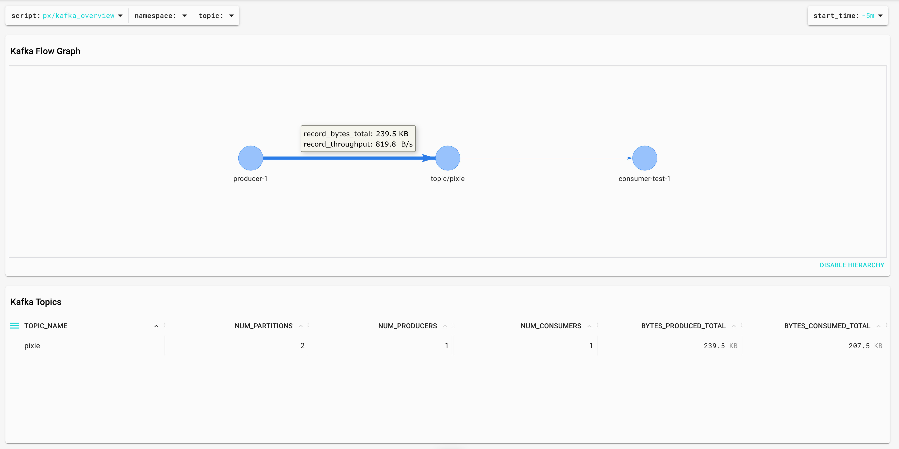

# Using Pixie to monitor a Strimzi kafka cluster

*23 August 2022*

## Introduction

In this article, we are going to see how to deploy a Kafka cluster in Kubernetes using [Strimzi](https://strimzi.io) and how to easily monitor it with [Pixie](https://pixielabs.ai).

## Kubernetes setup

We are going to use Google Cloud but you can use any cloud provider or on-prem solution.

Let's create the k8s cluster:

```bash
gcloud container clusters create antonmry-pixie-cluster  --num-nodes=2 --machine-type=e2-standard-8 --disk-size 300
```

And make sure we can connect to it:

```sh
gcloud container clusters get-credentials antonmry-pixie-cluster
kubectl get nodes
```

Note: kubectl doesn't work in some public WiFi when they are replacing TLS certificates.

See [Pixie's GKE setup](https://docs.pixielabs.ai/installing-pixie/setting-up-k8s/gke-setup/) official documentation for more info.

## Pixie deployment

Let's deploy Pixie now! The first step is to install the CLI tool. There are several ways to do it (see the [CLI documentation](https://docs.pixielabs.ai/installing-pixie/install-schemes/cli/) for more info). The easiest way is:

```sh
bash -c "$(curl -fsSL https://withpixie.ai/install.sh)"
```

Deploy Pixie in the Kubernetes cluster:

```sh
kubectl config current-context
px deploy
```

It takes some time. Once it's completed, check all pods are running:

```sh
kubectl get pods --all-namespaces
px debug pods
```

See the [Pixie Install Guides](https://docs.pixielabs.ai/installing-pixie/install-guides/) for more info.

We should be able to see the cluster monitoring in the Pixie UI now:


## Strimzi deployment

The first step is to deploy the operator in their own namespace:

```sh
kubectl create namespace kafka
kubectl create -f 'https://strimzi.io/install/latest?namespace=kafka' -n kafka 
kubectl get pods -n kafka
```

Wait until the pod is healthy and then, let's create the cluster:

```sh
kubectl apply -f https://raw.githubusercontent.com/strimzi/strimzi-kafka-operator/0.30.0/examples/kafka/kafka-persistent-single.yaml -n kafka
kubectl wait kafka/my-cluster --for=condition=Ready --timeout=300s -n kafka
kubectl get pods -n kafka
```

We should be able to list, create and describe topics:

```sh
kubectl -n kafka run kafka-topics -ti --image=quay.io/strimzi/kafka:0.25.0-kafka-2.8.0 --rm=true --restart=Never -- bin/kafka-topics.sh --bootstrap-server my-cluster-kafka-bootstrap:9092  --list

kubectl -n kafka run kafka-topics -ti --image=quay.io/strimzi/kafka:0.25.0-kafka-2.8.0 --rm=true --restart=Never -- bin/kafka-topics.sh --bootstrap-server my-cluster-kafka-bootstrap:9092 --create --topic pixie --replication-factor 1 --partitions 2

kubectl -n kafka run kafka-topics -ti --image=quay.io/strimzi/kafka:0.25.0-kafka-2.8.0 --rm=true --restart=Never -- bin/kafka-topics.sh --bootstrap-server my-cluster-kafka-bootstrap:9092  --describe pixie
```

It's possible to launch a consumer:

```sh
kubectl -n kafka run kafka-producer-perf-3 -ti --image=quay.io/strimzi/kafka:0.25.0-kafka-2.8.0 --rm=true --restart=Never -- bin/kafka-producer-perf-test.sh --topic pixie --throughput 1 --num-records 300000 --record-size 1024 --producer-props acks=all bootstrap.servers=my-cluster-kafka-bootstrap:9092
```

And in a different terminal, a producer:

```sh
kubectl -n kafka run kafka-consumer1 -ti --image=quay.io/strimzi/kafka:0.25.0-kafka-2.8.0 --rm=true --restart=Never -- bin/kafka-console-consumer.sh --bootstrap-server my-cluster-kafka-bootstrap:9092 --topic pixie  --consumer-property group.id=test #con1
```

Now we can see all Kafka resources in the UI selecting the Kafka Overview script:


It gives us the ability to identify consumers, producers, topics and the throughput between them:



How Pixie is able to obtain that information without instrumenting the broker or the apps? Using [eBPF](https://docs.px.dev/about-pixie/pixie-ebpf/) to parse the Kafka protocol between brokers and clients. This is more clear in the script `kafka data`:


We can even access the messages: the request, the response and the time between them (latency).

```json
{
   "time_":1661284918212,
   "source":{
      "label":"kafka/kafka-producer-perf-3",
      "script":"px/pod",
      "args":{
         "start_time":"-15m",
         "pod":"kafka/kafka-producer-perf-3"
      }
   },
   "destination":{
      "label":"kafka/my-cluster-kafka-0",
      "script":"px/pod",
      "args":{
         "start_time":"-15m",
         "pod":"kafka/my-cluster-kafka-0"
      }
   },
   "remote_port":33960,
   "req_cmd":"Produce",
   "req_body":{
      "transactional_id":"(empty string)",
      "acks":-1,
      "timeout_ms":30000,
      "topics":[
         {
            "name":"pixie",
            "partitions":[
               {
                  "index":1,
                  "message_set":{
                     "size":2128
                  }
               }
            ]
         }
      ]
   },
   "resp":{
      "topics":[
         {
            "name":"pixie",
            "partitions":[
               {
                  "index":1,
                  "error_code":"kNone",
                  "base_offset":0,
                  "log_append_time_ms":-1,
                  "log_start_offset":0,
                  "record_errors":[
                  ],
                  "error_message":"(empty string)"
               }
            ]
         }
      ],
      "throttle_time_ms":0
   },
   "latency":3102207
}
```

## Consumer Lag

Consumer Lag is one of the most important metrics for Kafka because it's a great indicator of problems. We can see it with the Kafka CLI tools:

```sh
kubectl -n kafka run kafka-consumer-lag -ti --image=quay.io/strimzi/kafka:0.25.0-kafka-2.8.0 --rm=true --restart=Never -- bin/kafka-consumer-groups.sh --bootstrap-server  my-cluster-kafka-bootstrap:9092 --describe --group test1
```

> GROUP           TOPIC           PARTITION  CURRENT-OFFSET  LOG-END-OFFSET  LAG             CONSUMER-ID                                          HOST            CLIENT-ID
>
> test            pixie           0          653             654             1               consumer-test-1-58e7aa2f-8015-4195-9ca0-db61307bbc29 /10.48.0.23     consumer-test-1
>
> test            pixie           1          653             654             1               consumer-test-1-58e7aa2f-8015-4195-9ca0-db61307bbc29 /10.48.0.23     consumer-test-1

Consumer Lag is the difference between LOG-END-OFFSET and CURRENT-OFFSET. Consumer Lag in offsets is hard to understand, it's easier if we measure it in time. Pixie is able to do this with the script `kafka_producer_consumer_latency`:


This is very different compared to other ways to calculate Consumer Lag ([Introducing uGroup: Uber's Consumer Management Framework] is a great article covering most of them). Pixie is tracking the Kafka protocol messages and calculating the lag as the difference between a Produce request and a Fetch request. It's possible to see the code in the UI (or even modify it!) opening the editor or directly in GitHub: [kafka_producer_consumer_latency.pxl](https://github.com/pixie-io/pixie/blob/db0ad3a9b3c7229f8e3dd57d9eea5a372e4670f2/src/pxl_scripts/px/kafka_producer_consumer_latency/kafka_producer_consumer_latency.pxl#L130).

## Kafka consumer rebalances

Kafka Consumer rebalances can be quite tricky. Kafka brokers and consumer instaces need to agree on the assignation of partitions and the throughput is affected during that process. Pixie provides a great way to identify rebalances with the [kafka_consumer_rebalancing.pxl](https://github.com/pixie-io/pixie/blob/main/src/pxl_scripts/px/kafka_consumer_rebalancing/kafka_consumer_rebalancing.pxl):


Again, it's using the Kafka protocol parsing to identify the rebalances and measure the duration. In this case, the difference between JoinGroup and SyncGroup messages. If you would like to know more about Kafka Rebalances, [Apache Kafka Rebalance Protocol, or the magic behind your streams applications](https://medium.com/streamthoughts/apache-kafka-rebalance-protocol-or-the-magic-behind-your-streams-applications-e94baf68e4f2) is a great source of information.

## Summary

In this article, we have covered how to use eBPF and Pixie to monitor Kafka in a different way. It's easy and it doesn't require redeployment of the applications. It uses a different approach (Kafka Protocol parsing) and it could be a great addition to your toolset if you are using Kubernetes.

There are more information in the [Pixie Kafka Monitoring](https://docs.pixielabs.ai/tutorials/pixie-101/kafka-monitoring/) tutorial and in this [Kafka Summit session](https://www.confluent.io/events/kafka-summit-london-2022/monitoring-kafka-without-instrumentation-using-ebpf/).

Did I miss something? You can comment on [GitHub](https://github.com/antonmry/galiglobal/pull/41) or just drop me a note on [Twitter](https://www.twitter.com/antonmry)!