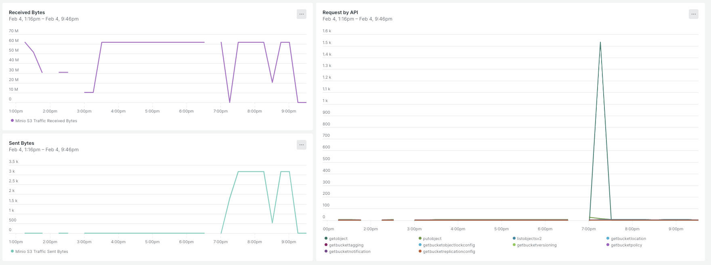

# Monitoring MinIO requests with the OpenTelemetry Collector

*04 February 2025*

I've been working on using Object Storage with Apache Flink to replace Kafka compacted topics or cross-VPC/AZ communication as explained in this [Flink Forward talk](https://www.ververica.academy/courses/3d163483-5040-4d60-b5b3-755c3277edf7/activities/45b8d081-140a-48f0-b385-8dd2edb8647d). The more we use it, the more important is to optimize the cost of the solution. It's usually driven by the number of requests to S3 so it's very important to me being able to quickly test different approaches to validate what's working well.

I typically use AWS S3 directly for that, but it's a bit cumbersome to monitor it. There's lag in the metrics and it's not easy to correlate the requests with the application logs. So I started using MinIO for local development. I was surprised to find how hard is to monitor it locally. In the UI, there's a note about metrics not being available:


I followed the documentation and it isn't straightforward. I tried with Claude/Gemini but both of them failed. It took me far more than I expected. In this article, I'll show you how to monitor MinIO requests with the OpenTelemetry Collector or Prometheus, or at least, how I do it now.

## Run MinIO

It's pretty easy to run MinIO locally. You can use the Docker image and run it with the following command:

```bash
docker run -d \
    -p "$MINIO_PORT:9000" \
    -p "$MINIO_CONSOLE_PORT:9001" \
    -v "$MINIO_DATA_DIR:/mnt/data" \
    -v "$MINIO_CONFIG_DIR:/root/.minio.sys" \
    -e "MINIO_ACCESS_KEY=$MINIO_ACCESS_KEY" \
    -e "MINIO_SECRET_KEY=$MINIO_SECRET_KEY" \
    --name "$MINIO_CONTAINER_NAME" \
    minio/minio server \
    --console-address ":9001" /mnt/data
```

You can use this script [minio.sh](https://gist.github.com/antonmry/535c62cae03bb2df089d1d6e858371b2#file-minio-sh) to run MinIO with the environment variables and proper configuration.

Once it's running, you can access the UI at `http://localhost:9001`. You can create a bucket and upload some files to test it.

## MinIO metrics

The next step is to enable Prometheus metrics in MinIO. You can do it by using the `mc` command line tool.

```bash
docker exec "$MINIO_CONTAINER_NAME" mc alias set 'myminio' "http://localhost:9000" "$MINIO_ACCESS_KEY" "$MINIO_SECRET_KEY"

docker exec "$MINIO_CONTAINER_NAME" mc admin prometheus metrics play system --api-version v3

docker exec "$MINIO_CONTAINER_NAME" mc admin prometheus generate myminio bucket > "$PROMETHEUS_CONFIG_FILE"
```

The first `mc` command creates an alias to the MinIO server with proper authentication. The second command shows the Prometheus metrics for the system and the third command generates the Prometheus configuration to be able to scrape the metrics with the proper key.

```yaml
scrape_configs:
- job_name: minio-job-bucket
  bearer_token: xxxxxxxxxxxxxxxxxxxxxxxxxxxxxxxxxxxxxxxxxxxxxxxxx
  metrics_path: /minio/v2/metrics/bucket
  scheme: http
  static_configs:
  - targets: ['localhost:9002']
```

Using that Prometheus file, you can configure Prometheus to scrape the metrics running the following command:

```bash
prometheus --config.file=prometheus.yml
```

If you aren't using the same port in the container to connect, you need to change the `prometheus.yml` file to use the proper port. You can access the Prometheus UI at `http://localhost:9090` to validate that the metrics are being scraped.

This script [prometheus.sh](https://gist.github.com/antonmry/535c62cae03bb2df089d1d6e858371b2#file-prometheus-sh) automate the process of activating the metrics and generating the config file.

## Otel Collector & New Relic

The OpenTelemetry Collector is a powerful tool to collect, process, and export telemetry data. It's very easy to use and it has a lot of exporters to send the data to different backends. You can use it to collect the MinIO metrics and send them to New Relic or any other backend.

The script [prometheus.sh](https://gist.github.com/antonmry/535c62cae03bb2df089d1d6e858371b2#file-prometheus-sh) generate the configuration file for the Otel and you can run it with the following command:

```bash
otelcol-contrib  --config=config.yml
```

It's very easy to add more exporters to the configuration file. In my case, I use New Relic to monitor the applications, so I added the New Relic exporter to the configuration file.

```yaml
exporters:
  otlphttp:
    endpoint: <INSERT_NEW_RELIC_OTLP_ENDPOINT>
    headers:
      api-key: <INSERT_NEW_RELIC_LICENSE_KEY>
```

You can find more information about the Otel Collector in the [New Relic Otel Collector documentation](https://docs.newrelic.com/docs/opentelemetry/get-started/collector-processing/opentelemetry-collector-processing-intro/#minimal-example).

Once the collector is running, you can access the New Relic UI to see the metrics. You can create a dashboard to monitor the MinIO requests and correlate them with the application logs.



The dashboard can be imported using the provided JSON template [minio-dashboard.json](https://gist.github.com/antonmry/535c62cae03bb2df089d1d6e858371b2#file-newrelic_dashboard-json). The most critical metrics to monitor are:

- Request counts by operation type, particularly `ListObjectsV2` operations since these don't transfer data but can significantly impact costs. Monitoring these requests helps identify potential optimization opportunities in your application's listing behavior.
- The PutObject operation count provides insights into your batching efficiency. By correlating this metric with your job's configuration parameters, you can fine-tune batch sizes and intervals for optimal performance.

End-to-end latency is another crucial metric that we monitor. However, since this involves a different monitoring approach and setup, I'll cover it in detail in an upcoming article focused on latency tracking.

## Conclusion

If you use object storage in your streaming pipelines, it's very important to minimize the number of requests to the storage. MinIO with proper monitoring will help you to validate the optimizations and reduce the cost of the solution. If you have any questions or comments, please let me know. You can reach me on [BlueSky](https://bsky.app/profile/galiglobal.com) or [GitHub](https://github.com/antonmry/galiglobal/discussions).