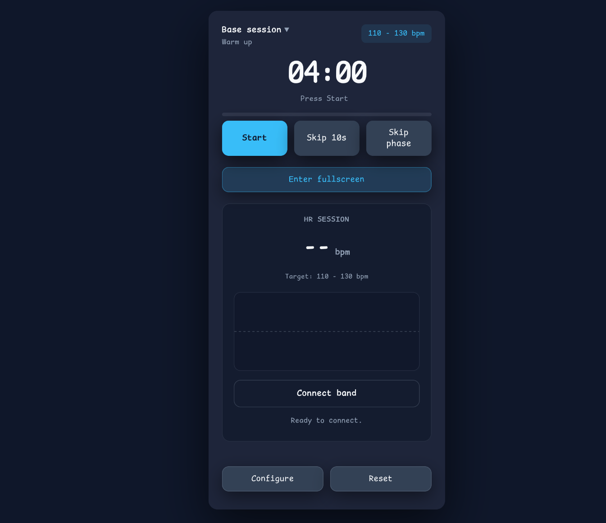

# Building LocalFirstPacer: a small running tool for someone you care about

_11 November 2025_

---

One unexpectedly joyful category of software: making tiny useful apps for people
you personally know intimately. Not a startup. Not a “platform opportunity”.
Just shipping a thing that actually moves the needle for exactly one real human.

In my case: my wife started running recently. And she is getting serious about
Zone 2. Heart rate guided, low intensity, aerobic base building. She needed
something simple to help her pace and structure interval sessions.

[This post about a calendar application](https://blog.6nok.org/my-most-popular-application/)
inspired me. The idea that your most meaningful software can be something
extremely narrow, but deeply useful for exactly one person.

That unlocked the project:
**[LocalFirstPacer](https://github.com/antonmry/LocalFirstPacer)**.

## Why Local First + PWA was perfect here

When you build for someone you love, something becomes extremely obvious: you
don’t want their physiological telemetry drifting through random servers.

**Local-first** means everything runs locally on the browser. Data lives on the
device. Not in a cloud backend. Not indexed by someone else. Not sent to third
parties you never approved.

A **PWA (Progressive Web App)** means:

- it installs on the phone like a regular app
- it works offline
- it can run on the track without connectivity
- it updates automatically, without App Store ceremonies

So the intersection is powerful:

| Local First       | PWA            |
| ----------------- | -------------- |
| privacy friendly  | simple install |
| no servers needed | offline        |
| zero infra        | feels native   |

This combination is much more powerful than most devs assume. Especially for
single-purpose personal tools.

## Using code agents to build this fast

This project is also a real case study in agent based coding. Not “auto dev for
a startup”. Very targeted. Very scoped.

And if you use them correctly, you can go faster than hand coding from scratch,
even if you are fully capable of coding by hand.

I am not a frontend engineer. I am backend / data. Historically this kind of
project felt intimidating to me. I always assumed I needed a JS framework,
build tooling, boilerplate, large architecture. This project broke that
assumption completely. Here are the specific workflow patterns that actually
worked.

### 1) Start with chat, not code

I first talked through the idea with the model conversationally. I validated the
scope. Then I asked the model to generate a minimal `index.html` just to test
the timer and see if the UX direction was right.

Only when this micro prototype felt coherent, I asked the model to create:

- README.md
- AGENTS.md

These two files became the contract for the dev loop.

I asked the agent to use only vanilla HTML/JS/CSS. In my experience, they work
much better avoiding frameworks and libraries.

### 2) CLI agents outperform GUI “builders” during iteration

I ran the agent inside a terminal environment. This matters because terminals
today allow pasting screenshots and structured error logs easily. This ended up
being the fastest possible loop: prompt → run → screenshot → adjust prompt →
run again.

### 3) Isolate complex features into separate pages

Heart rate via Web Bluetooth is notoriously annoying to debug. So I created a
separate `hrm.html` just to validate:

- device discovery
- service + characteristic mapping
- streaming notifications

Only when it worked in isolation did I ask the agent to merge into the main app
UI. This reduced hallucination risk dramatically.

### 4) When an agent stalls or derails, abandon the thread

Adding English/Spanish support, I hit a dead end. The agent started insisting
on structures that didn’t exist. I stopped. Deleted the attempt. New session.
Clean framing. It worked.

Agents are extremely sensitive to local context pollution. Don’t be romantic
about sunk work.

### 5) Git + GitHub + infra is force multiplication

This is the boring truth: infra makes agent workflows real.

- GitHub Pages to deploy instantly
- GitHub Actions to auto build
- Docker container as the safe sandbox
- Codespaces for portable dev environment

If I give an agent write access to the full project folder inside Docker, I am
not afraid of the blast radius. Everything is isolated.

## Closing reflection

This project is tiny. But it has very high personal ROI. A person I care about
benefited from it immediately. And I learned a repeatable pattern:

- small scoped problem
- PWA
- Local First
- iterative agent coding
- infra guardrails

This pattern scales surprisingly well for “one person tools”.

The best feeling moment of the whole project was when I asked my wife: _“What
should I improve next?”_ And she said: **“Nothing. It’s perfect. Thank you.”**

That was the entire payoff.

Comments? You can find me in [BlueSky](https://bsky.app/profile/anton.galiglobal.com).

