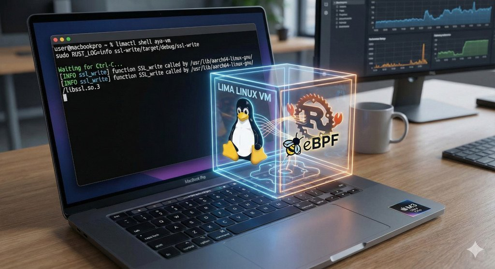

# eBPF with Rust using Aya (from macOS, Windows, or Linux)

*19 November 2025*

---

[eBPF] is one of those technologies that immediately feels powerful but rarely
feels friendly at the start. I wanted to experiment with user‑space probes using
Rust and [Aya], but the setup itself was solid, but the combination of ARM
processors, Podman security constraints, and Aya’s toolchain requirements made
the early steps unexpectedly tricky: a Mac Studio M3 Ultra as the primary
machine and a Linux laptop where container‑based attempts (Podman) were
unreliable. Aya itself pulls in a non‑trivial toolchain, and I initially ended
up on nightly Rust with a scattered set of workarounds.

This post documents the setup that finally worked cleanly. It is reproducible,
fast to iterate on, and avoids most of the early‑stage pain.



## Environment setup

Using a VM turned out to be far simpler than running everything inside
containers. [Lima](https://lima-vm.io/) provides lightweight Linux VMs on macOS
with minimal friction and predictable networking.

I started by adapting the CI configuration from the Aya template repository. You
can find my Lima template here:

[https://github.com/antonmry/rust-playground/blob/main/ebpf-aya/lima-aya.yaml](https://github.com/antonmry/rust-playground/blob/main/ebpf-aya/lima-aya.yaml)

If you read this in the future, consider regenerating the template from the
latest upstream CI file.

Start the VM:

```sh
limactl start --name aya-vm --mount-only .:w lima-aya.yaml
```

Enter the VM:

```sh
limactl shell aya-vm
```

Verify eBPF support:

```sh
limactl shell aya-vm sudo bpftrace -l
limactl shell aya-vm sudo bpftool feature probe
```

## Probing SSL_write with bpftrace

Before writing any Rust code, I validated the target probe using `bpftrace`.
Depending on architecture:

**ARM:**

```sh
limactl shell aya-vm sudo bpftrace -e 'uprobe:/usr/lib/aarch64-linux-gnu/libssl.so.3:SSL_write { printf("SSL_write PID=%d
", pid); }'
```

**x86_64:**

```sh
limactl shell aya-vm sudo bpftrace -e 'uprobe:/usr/lib/x86_64-linux-gnu/libssl.so.3:SSL_write { printf("SSL_write PID=%d
", pid); }'
```

In another terminal:

```sh
limactl shell aya-vm curl -v https://www.galiglobal.com
```

You should see repeated `SSL_write` events.

## Generating the Aya project

Aya provides a project template via `cargo-generate`. Create a new uprobe‑based
program targeting `SSL_write`:

**ARM:**

```sh
limactl shell aya-vm cargo generate \
  --git https://github.com/aya-rs/aya-template \
  --branch main \
  --name ssl-write \
  --define program_type=uprobe \
  --define uprobe_fn_name=SSL_write \
  --define uprobe_target=/usr/lib/aarch64-linux-gnu/libssl.so.3
```

**x86_64:**

```sh
limactl shell aya-vm cargo generate \
  --git https://github.com/aya-rs/aya-template \
  --branch main \
  --name ssl-write \
  --define program_type=uprobe \
  --define uprobe_fn_name=SSL_write \
  --define uprobe_target=/usr/lib/x86_64-linux-gnu/libssl.so.3
```

Build:

```sh
limactl shell aya-vm bash -lc 'cd ssl-write && cargo build'
```

Run the program:

```sh
limactl shell aya-vm sudo RUST_LOG=info ssl-write/target/debug/ssl-write
```

Trigger SSL activity again:

```sh
limactl shell aya-vm curl -v https://www.galiglobal.com
```

Output should resemble:

```text
Waiting for Ctrl-C...
[INFO ssl_write] function SSL_write called by /usr/lib/x86_64-linux-gnu/libssl.so.3
...
```

## Closing notes

This setup makes Aya development on Apple Silicon straightforward and
predictable. VM boot is fast, the toolchain stays contained, and the feedback
loop is tight. If you're experimenting with eBPF from macOS, Lima plus the Aya
template is a practical baseline.

Comments? You can find me on BlueSky:
[https://bsky.app/profile/anton.galiglobal.com](https://bsky.app/profile/anton.galiglobal.com)

[eBPF]: https://ebpf.io
[Aya]: https://aya-rs.dev
