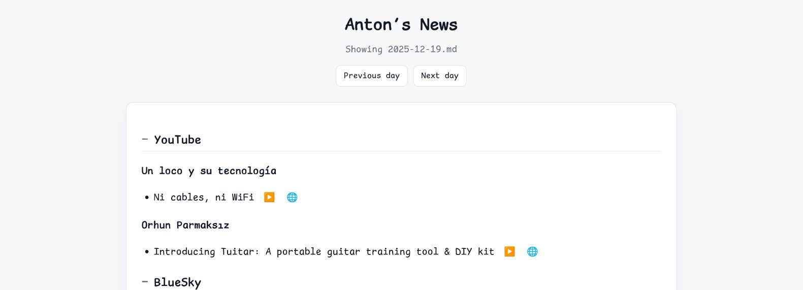

# Git and Markdown are all you need

*21 December 2025*

---

Lately I've been creating and using personal software in a different way, and
it has become a pattern: Git to store and sync, Markdown to write, and a few
tiny scripts to glue everything together. No frameworks, no databases, no
vendors. Writing it down might help anyone who wants a simple, portable setup
they fully own.

## How it started

It all started with Obsidian, my notes system. It isn't anything fancy: just a
private repo on GitHub. I still use the mobile app, but after a while I dropped
the desktop app and switched to Neovim with
[moxide LSP](https://github.com/antonmry/dotfiles/blob/main/config/nvim/ftplugin/markdown.lua#L23).

This has been working well for me. Using git to sync between machines is pretty
natural, even on the phone using [Termux](https://termux.dev/en/) and a simple
Bash script launched from a homescreen shortcut.

Every day the app on the phone generates a new entry from a
template with the tasks I do and the sections I like to keep updated.

I wanted the entries from my calendars too, so I vibe-coded a simple Python
script that reads from Google Calendar and creates the file. Every day a GitHub
Actions workflow generates the file at 4:00AM and commits to GitHub. This could
be done in a million ways, but this one was particularly easy and works well.

## That project I never had time for

After that, I decided I also wanted a daily report of the news I follow:
BlueSky, blogs, releases in GitHub, etc. I still miss Google Reader. Again, I
created [a repo on GitHub](https://github.com/antonmry/news), vibe-coded a
couple of Python scripts, a daily GitHub Actions workflow and an HTML page, and
I have now
[my own site of news curated for me](https://news.anton.galiglobal.com). I'm
even using GitHub AI models to summarize the longer entries. It couldn't be
easier!

Finally, I did the same with my blog. Dealing with Hugo (and don't ask me about
JBake) was frustrating and time consuming. Now it's just a couple of vibe-coded
Python scripts with [uv](https://github.com/astral-sh/uv) and it's done. I also
added RSS and comments from Leaflet (big thanks to
[SharpMars](https://sharpmars.nekoweb.org/blog/hooking-into-leaflet) for the
idea!). Combining this approach with [at-proto](https://atproto.com) services
like [BlueSky](https://bsky.app/profile/anton.galiglobal.com) or
[Leaflet](https://blog.anton.galiglobal.com) works really well for me.

Git keeps me portable: I can move easily to any Git host (GitHub,
[Tangled](https://tangled.org/), whatever comes next) and I can host it with
GitHub Pages or Cloudflare Pages on my own domain. It also works great with the
GitHub app. I use it to navigate the repo, search, make changes, or explore my
notes with an AI agent in the app. I can evolve the setup with the functionality
that matters to me and I'm the owner of the whole thing. I don't depend on a
company and I'm not exposed to ads in the process. The stack is boring by
design: text files, Git history, and a browser. That keeps the surface small,
the backups easy, and the odds of future breakage low.

## AI is changing how we consume software

None of this is rocket science. It breaks, but it's easy to fix: a quick prompt
and a code agent usually solve it. When something fails, I paste the error into
an AI prompt, get a patch, and move on. Most issues are wiring problems, not
architecture problems, so the fixes are fast.

The same pattern shows up on my workstation. I tried several apps to lower the
burden of reviewing PRs. I even used
[prr](https://github.com/danobi/prr), but having to create a personal token was
a problem. Nowadays I use a
[Bash script](https://github.com/antonmry/dotfiles/blob/main/bin/review.sh) with
the GitHub CLI to review PRs and it works really well. It allows me to review
PRs quickly and properly from the terminal. I can't live without it!

With more software than ever, my bar to install something new is ridiculously
high. Most of what a fancy app offers I can get with the tools I've always used
(Neovim, Alacritty, ZelliJ and Firefox) plus a handful of vibe-coded scripts.
It's easier for me because I don't have to learn another tool, and easier for
the agent because it already knows how to work with these boring, well-known
ones. It's almost 2026 and I spend more time in the terminal than ever. The
only app I keep open all day is Slack, and thanks to Recap I spend less time in
it than ever.

These simple utilities shape how I see the future of software: solid building
blocks, open source, highly adaptable to the user, and easy to wire together
with Git and Markdown. It is often faster to vibe-code a 30-line script than to
bend a complex app like Hugo or a full IDE into doing what you want. Owning the
small pieces keeps you in control and keeps the stack understandable years
later.
