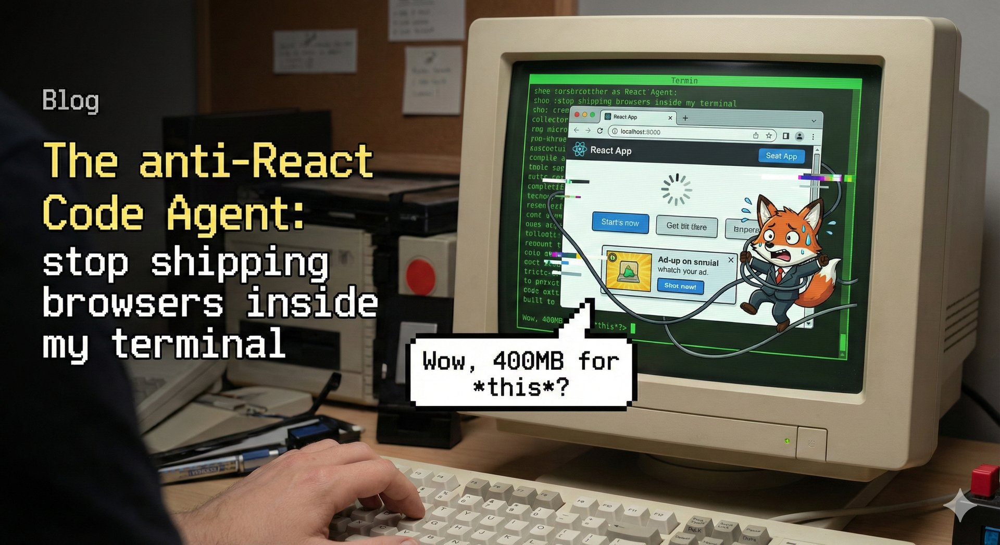

# Get React out of my terminal: a case for headless mode

*22 February 2026*

---

Code agents are fun. I use them every day. They fit neatly into the tools I
already use: [Bash][bash], [Zellij][zellij], [Git][git], and more. But if
you live in a terminal, a lot of "code agents" feel like hostile web apps
ported into a CLI.

Take Claude Code. I run Claude Opus through it often. The model is excellent.
The client is one of the worst terminal experiences I've seen: slow, buggy, and
somehow using ~400 MB of RAM per instance for what is essentially a cloud API
wrapper. React in a terminal is a self-inflicted wound.

OpenCode isn't much better: basic UX like copy/paste breaks inside a VM. At
least it lets you switch models, and it's open source. Codex is the best of the
bunch, faster and lighter, but still bloated. It amazes me how much these tools
struggle with something the terminal already does natively: scrolling.

Here's the part that hurts most: being forced to use a specific client if I want
to use a specific model. Anthropic models are great for agentic tasks. They're
more decisive, more willing to take risks, and more proactive than OpenAI or
Google models. For code quality, I still find OpenAI better, but only with much
more human guidance. Google Gemini shines in non-coding tasks but is still weak
at tool calling.

If I want Claude Opus through a subscription, I'm forced into Claude Code.
That's not good. Yes, I can use the API instead, but why should I pay 10x more
just to use the tools I like? That's absurd.

Another trend that annoys me is how these tools are starting to babysit power
users. The best example is compaction: automatic summarization to save tokens.
It's useful when I ask for it. It's infuriating when it happens on its own and
discards the constraints I just spent time setting. That might help
non-technical users. For power users, it's often counterproductive and
frustrating, especially given how buggy it can be.

So I started thinking about how to make code agents fit my workflow without
fighting the terminal. I wanted something that follows the
[Unix philosophy][unix-philosophy]: small pieces you can compose. The answer
was already there: headless mode.

You can run `claude -p` to send a prompt, get a response, and exit. Everything
else in Claude Code is just layers on top. Most code agents work the same way.

So what happens if you stop using the TUI and just drive headless mode? Turns
out it's not only possible, it's surprisingly effective. It also forces you to
learn what "agentic engineering" actually means when the TUI is no longer doing
the thinking for you.

Before I knew it, I'd built [BREO][breo]: the
Browserless React-free Execution Operator. It's meant for my workflow, not
yours, but the patterns are portable. This is what
[BREO][breo] currently does:

- Runs Claude Code, Codex, and Gemini headlessly. No TUIs. No React.
  Subscriptions, not API keys.
- Makes it easy to switch between agents and models.
- Persists conversations in Git with fuzzy search, renaming, and history.
- Saves full state (conversation, agent, model, sandbox), so sessions resume
  cleanly in any folder.
- Lets me decide when compaction happens.
- Defaults to YOLO mode inside a sandbox
  ([LimaVM][limavm] for now), because that's how I
  usually work with agents.

I usually start a conversation with:

```sh
breo -c new_data_api "Let's plan a new data API for my service"
```

It prints a response, and then I continue the conversation with another command.
It remembers and persists the thread:

```sh
breo "Let's run an E2E test to validate that the feature works as expected"
```

I can run other tools between messages, and I can also change the agent or the
model in the next message:

```sh
breo -a codex "Let's update the SPEC with our findings"
```

BREO saves the last conversation, agent, model, and sandbox per folder, so I
don't have to think about it. At any moment, `breo status` tells me what's being
used:

```text
directory:     /Users/antonmry/Workspace/Galiglobal/breo
config:        /Users/antonmry/.config/breo
conversations: /Users/antonmry/.config/breo/conversations/breo
conversation:  2026-02-18_20-09-40
agent:         claude
sandbox:       default
```

The nicest thing is that it enables stronger workflows. I kept cycling through
planning, implementation, and verification, so I built my own loop to offload
part of that work to agents: `breo loop`. It takes `PLAN.md` (what to build)
and `VERIFICATION.md` (how to prove it works). It lets me select different
agents for implementation and verification. The implementation agent keeps
iterating until the verification agent can complete the E2E tests and validate
the result.

I usually prefer Codex for implementation because the code is less verbose, and
Claude Code for verification because it doesn't stop when it hits an environment
problem. Since everything runs inside a VM, I don't care if it nukes the
sandbox along the way. This loop workflow uses the strengths of both models
while minimizing their weaknesses.

This is only one example of how I adapted ideas like
[Ralph][ralph] or [Beads][beads] to my own workflow. I'm already thinking about
how to add [Claws][claws] or spec-driven flows with [Allium][allium]. The point
isn't to adopt a tool vibe-coded by another developer (including [BREO][breo]).
It's to understand the pattern and explore it yourself. Agentic engineering is
going to be a big field in software engineering, and it isn't about just using
tools. It's about understanding how to work with agents in the most effective
way. For that, you need to remove layers of unnecessary code.

There's a lot of noise and marketing around code agents right now. As usual,
when something goes mainstream, it gets worse and more bloated. But don't forget
the fundamentals: understand how code agents work, master headless mode,
identify the powerful patterns, and wire them into your workflow. That's what
drives personal productivity, not the latest shiny, bloated UI you'll forget in
three days.



[allium]: https://juxt.github.io/allium/
[bash]: https://www.gnu.org/software/bash/
[beads]: https://github.com/steveyegge/beads
[breo]: https://github.com/antonmry/breo
[claws]: https://xcancel.com/karpathy/status/2024987174077432126
[git]: https://git-scm.com/
[limavm]: https://github.com/lima-vm/lima
[ralph]: https://ghuntley.com/loop/
[unix-philosophy]: https://en.wikipedia.org/wiki/Unix_philosophy
[zellij]: https://zellij.dev/
