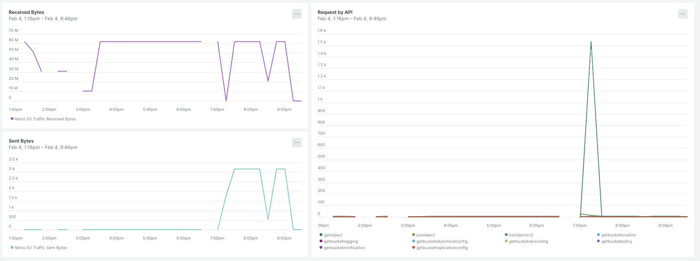

title=Monitoring MinIO requests with the OpenTelemetry Collector
date=2025-02-04
type=post
tags=MinIO, OpenTelemetry, S3, Flink
status=published
---------

I've been working on using Object Storage with Apache Flink to replace Kafka
compacted topics or cross-VPC/AZ communication as explained in this [Flink
Forward talk]. The more we use it, the more important is to optimize the cost
of the solution. It's usually driven by the number of requests to S3 so it's
very important to me being able to quickly test different approaches to
validate what's working well.

I typically use AWS S3 directly for that, but it's a bit cumbersome to monitor
it. There's lag in the metrics and it's not easy to correlate the requests with
the application logs. So I started using MinIO for local development. I was
surprised to find how hard is to monitor it locally. In the UI, there's a note
about metrics not being available:


I followed the documentation and it isn't straightforward. I tried with
Claude/Gemini but both of them failed. It took me far more than I expected. In
this article, I'll show you how to monitor MinIO requests with the
OpenTelemetry Collector or Prometheus, or at least, how I do it now.

## Run MinIO

It's pretty easy to run MinIO locally. You can use the Docker image and run it
with the following command:

```bash
docker run -d \
    -p "$MINIO_PORT:9000" \
    -p "$MINIO_CONSOLE_PORT:9001" \
    -v "$MINIO_DATA_DIR:/mnt/data" \
    -v "$MINIO_CONFIG_DIR:/root/.minio.sys" \
    -e "MINIO_ACCESS_KEY=$MINIO_ACCESS_KEY" \
    -e "MINIO_SECRET_KEY=$MINIO_SECRET_KEY" \
    --name "$MINIO_CONTAINER_NAME" \
    minio/minio server \
    --console-address ":9001" /mnt/data
```

You can use this script [minio.sh] to run MinIO with the environment variables
and proper configuration.

Once it's running, you can access the UI at `http://localhost:9001`. You can
create a bucket and upload some files to test it.

## MinIO metrics

The next step is to enable Prometheus metrics in MinIO. You can do it by
using the `mc` command line tool.

```bash
docker exec "$MINIO_CONTAINER_NAME" mc alias set 'myminio' "http://localhost:9000" "$MINIO_ACCESS_KEY" "$MINIO_SECRET_KEY"

docker exec "$MINIO_CONTAINER_NAME" mc admin prometheus metrics play system --api-version v3

docker exec "$MINIO_CONTAINER_NAME" mc admin prometheus generate myminio bucket > "$PROMETHEUS_CONFIG_FILE"
```

The first `mc` command creates an alias to the MinIO server with proper
authentication. The second command shows the Prometheus metrics for the system
and the third command generates the Prometheus configuration to be able to
scrape the metrics with the proper key.

```yaml
scrape_configs:
- job_name: minio-job-bucket
  bearer_token: xxxxxxxxxxxxxxxxxxxxxxxxxxxxxxxxxxxxxxxxxxxxxxxxx
  metrics_path: /minio/v2/metrics/bucket
  scheme: http
  static_configs:
  - targets: ['localhost:9002']
```

Using that Prometheus file, you can configure Prometheus to scrape the metrics
running the following command:

```bash
prometheus --config.file=prometheus.yml
```

If you aren't using the same port in the container to connect, you need to
change the `prometheus.yml` file to use the proper port. You can access the
Prometheus UI at `http://localhost:9090` to validate that the metrics are being
scraped.

This script [prometheus.sh] automate the process of activating the metrics and
generating the config file.

## Otel Collector & New Relic

The OpenTelemetry Collector is a powerful tool to collect, process, and export
telemetry data. It's very easy to use and it has a lot of exporters to send the
data to different backends. You can use it to collect the MinIO metrics and
send them to New Relic or any other backend.

The script [prometheus.sh] generate the configuration file for the Otel and
you can run it with the following command:

```bash
otelcol-contrib  --config=config.yml
```

It's very easy to add more exporters to the configuration file. In my case, I
use New Relic to monitor the applications, so I added the New Relic exporter to
the configuration file.

```yaml
exporters:
  otlphttp:
    endpoint: <INSERT_NEW_RELIC_OTLP_ENDPOINT>
    headers:
      api-key: <INSERT_NEW_RELIC_LICENSE_KEY>
```

You can find more information about the Otel Collector in the [New Relic Otel
Collector documentation].

Once the collector is running, you can access the New Relic UI to see the
metrics. You can create a dashboard to monitor the MinIO requests and correlate
them with the application logs.



The dashboard can be imported using the provided JSON template
[minio-dashboard.json]. The most critical metrics to monitor are:

- Request counts by operation type, particularly `ListObjectsV2` operations
  since these don't transfer data but can significantly impact costs.
  Monitoring these requests helps identify potential optimization opportunities
  in your application's listing behavior.
- The PutObject operation count provides insights into your batching
  efficiency. By correlating this metric with your job's configuration
  parameters, you can fine-tune batch sizes and intervals for optimal
  performance.

End-to-end latency is another crucial metric that we monitor. However, since
this involves a different monitoring approach and setup, I'll cover it in
detail in an upcoming article focused on latency tracking.

## Conclusion

If you use object storage in your streaming pipelines, it's very important to
minimize the number of requests to the storage. MinIO with proper monitoring
will help you to validate the optimizations and reduce the cost of the
solution. If you have any questions or comments, please let me know. You can
reach me on [BlueSky] or [GitHub].

[Flink Forward talk]: https://www.ververica.academy/courses/3d163483-5040-4d60-b5b3-755c3277edf7/activities/45b8d081-140a-48f0-b385-8dd2edb8647d
[BlueSky]: https://bsky.app/profile/galiglobal.com
[GitHub]: https://github.com/antonmry/galiglobal/discussions
[minio.sh]: https://gist.github.com/antonmry/535c62cae03bb2df089d1d6e858371b2#file-minio-sh
[prometheus.sh]: https://gist.github.com/antonmry/535c62cae03bb2df089d1d6e858371b2#file-prometheus-sh
[New Relic Otel Collector documentation]: https://docs.newrelic.com/docs/opentelemetry/get-started/collector-processing/opentelemetry-collector-processing-intro/#minimal-example
[minio-dashboard.json]: https://gist.github.com/antonmry/535c62cae03bb2df089d1d6e858371b2#file-newrelic_dashboard-json
