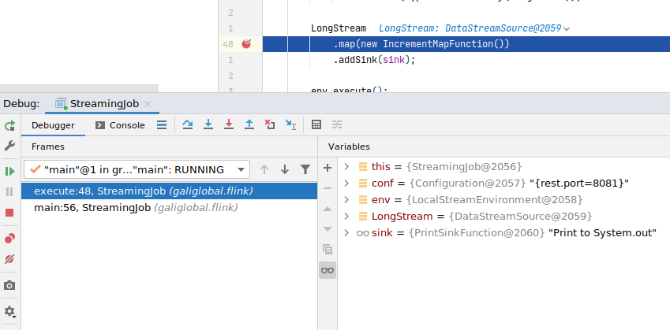
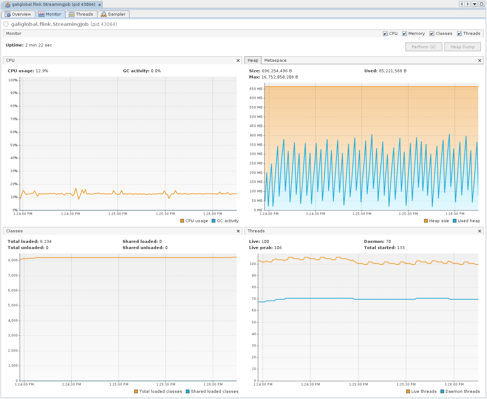
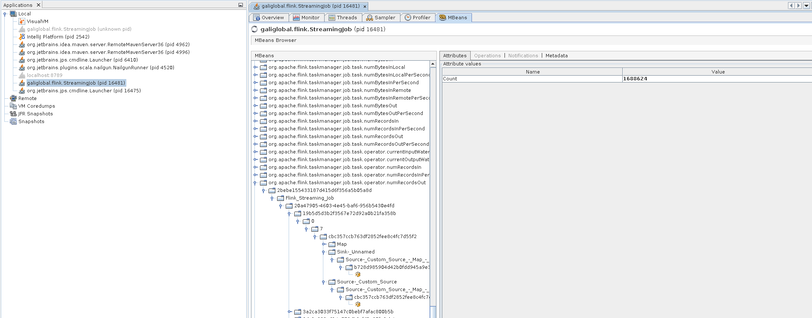
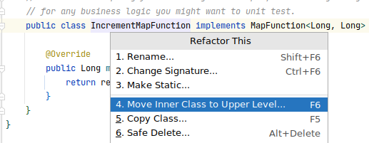

title=Flink setup for development (and some IntelliJ Idea cool tricks)
date=2021-01-30
type=post
tags=Flink
status=published
~~~~~~

## Introduction

[Apache Flink] is an open-source, unified stream-processing and
batch-processing framework. As any of those framework, start to work with it
can be a challenge. Even if there is a good [Getting Started] or a great (and
free) [Hands-on Training], there are always questions about how to start, how
to debug problems or how to launch the project in your IDE.

In this article, I summarize some of the notes I've been writing since
I started with Flink. If Flink is something new for you, it's an easy guide to
follow. If you are already an experienced Flink developer, there are some
tricks you may find useful: access to JMX metrics, profiling, etc.

The source code is available in this [GitHub repository].

## Install Flink

The first step is to install Flink. This is straightforward, just go to the
Flink download page and download it:

```sh
wget https://archive.apache.org/dist/flink/flink-1.12.0/flink-1.12.0-bin-scala_2.12.tgz
tar -zxvf flink-1.12.0-bin-scala_2.12.tgz
```

Note: it's a good idea to create a variable $FLINK_HOME pointing to the Flink
folder.

Start the cluster:

```sh
$FLINK_HOME/bin/start-cluster.sh
```

You can access the [Flink Web Dashboard] in your browser.

We aren't going to need it initially so it's better to stop it:

```sh
$FLINK_HOME/bin/stop-cluster.sh
```

## Bootstrap a Flink job

To bootstrap the project, just execute the following Maven command:

```sh
mvn archetype:generate                               \
    -DarchetypeGroupId=org.apache.flink \
    -DarchetypeArtifactId=flink-quickstart-java \
    -DarchetypeVersion=1.12.0 \
    -DgroupId=galiglobal \
    -DartifactId=flink-playground \
    -Dversion=0.1 \
    -Dpackage=galiglobal.flink \
    -DinteractiveMode=false

cd flink-playground
```

The structure of the project is quite simple:

```
.
├── pom.xml
└── src
    └── main
        ├── java
        │   └── galiglobal
        │       └── flink
        │           ├── BatchJob.java
        │           └── StreamingJob.java
        └── resources
            └── log4j2.properties
```

We are going to focus only on `StreamingJob.java`.

## Import and run the job in IntelliJ IDEA

We are going only to cover my favourite Java IDE: IntelliJ IDEA. Other IDEs
should work similarly. First of all, import in the IDE as a maven project. You
can do it easily from the command-line.

```sh
idea pom.xml
```

You can go to `StreamingJob.java` and execute it as a normal Java application
using the Shift+F10 shortcut on Linux/Windows. An error like this should appear
in the output:

> Exception in thread "main" java.lang.NoClassDefFoundError: org/apache/flink/streaming/api/environment/StreamExecutionEnvironment
> 	at galiglobal.flink.StreamingJob.main(StreamingJob.java:39)
> Caused by: java.lang.ClassNotFoundException: org.apache.flink.streaming.api.environment.StreamExecutionEnvironment
> 	at java.net.URLClassLoader.findClass(URLClassLoader.java:382)
> 	at java.lang.ClassLoader.loadClass(ClassLoader.java:418)
> 	at sun.misc.Launcher$AppClassLoader.loadClass(Launcher.java:352)
> 	at java.lang.ClassLoader.loadClass(ClassLoader.java:351)
> 	... 1 more

This is a particular problem of Flink running in the IDE: some dependencies are
missing. To solve it, go to `Run` -> `Edit Configuration` -> `Modify options`
-> `Use classpath of module` and in the new field, mark `Include dependencies
with "Provided" scope`.


Re-run the job and a new error appears:

> Exception in thread "main" java.lang.IllegalStateException: No operators defined in streaming topology. Cannot execute.
> 	at org.apache.flink.streaming.api.environment.StreamExecutionEnvironment.getStreamGraphGenerator(StreamExecutionEnvironment.java:2000)
> 	at org.apache.flink.streaming.api.environment.StreamExecutionEnvironment.getStreamGraph(StreamExecutionEnvironment.java:1991)
> 	at org.apache.flink.streaming.api.environment.StreamExecutionEnvironment.getStreamGraph(StreamExecutionEnvironment.java:1976)
> 	at org.apache.flink.streaming.api.environment.StreamExecutionEnvironment.execute(StreamExecutionEnvironment.java:1822)
> 	at galiglobal.flink.StreamingJob.main(StreamingJob.java:62)

It's time to create our Flink job.

## Develop our first Flink job

Let's add a new Java class to our project called `RandomLongSource`:

```java
public class RandomLongSource extends RichParallelSourceFunction<Long> {

    private volatile boolean cancelled = false;
    private Random random;

    @Override
    public void open(Configuration parameters) throws Exception {
        super.open(parameters);
        random = new Random();
    }

    @Override
    public void run(SourceContext<Long> ctx) throws Exception {
        while (!cancelled) {
            Long nextLong = random.nextLong();
            synchronized (ctx.getCheckpointLock()) {
                ctx.collect(nextLong);
            }
        }
    }

    @Override
    public void cancel() {
        cancelled = true;
    }
}
```

This class is just generating an infinite series of long numbers to feed our
job.

Let's modify now `StreamingJob.java` to process it and print the result:

```java
public class StreamingJob {
    private SourceFunction<Long> source;
    private SinkFunction<Long> sink;

    public StreamingJob(SourceFunction<Long> source, SinkFunction<Long> sink) {
        this.source = source;
        this.sink = sink;
    }

    public void execute() throws Exception {
        StreamExecutionEnvironment env = StreamExecutionEnvironment.getExecutionEnvironment();

        DataStream<Long> LongStream =
            env.addSource(source)
                .returns(TypeInformation.of(Long.class));

        LongStream
            .map(new IncrementMapFunction())
            .addSink(sink);

        env.execute();
    }

    public static void main(String[] args) throws Exception {
        StreamingJob job = new StreamingJob(new RandomLongSource(), new PrintSinkFunction<>());
        job.execute();
    }

    public class IncrementMapFunction implements MapFunction<Long, Long> {

        @Override
        public Long map(Long record) throws Exception {
            return record + 1;
        }
    }
}
```

Note: this class is from the [Hands-on Training].

If you execute it, you will see an infinite list of long numbers:

> ...  
> 3> 3869376031196493001  
> 12> 4265560998598976840  
> 12> -7434045225389162179  
> 1> 3964290136030554255  
> 1> 8881056576399978883  
> ...  

Note: The 3>, 12>, 1> indicate which sub-task (i.e., thread) produced the
output.

This is one of the most surprising things for Flink beginners: you don't need
a cluster to develop a Flink job, you can easily do it locally from your IDE
and it works quite well.

There are some minor differences. For example, to access the [Flink Web
Dashboard] you will need to add the following dependency to maven:

```xml
<dependency>
	<groupId>org.apache.flink</groupId>
	<artifactId>flink-runtime-web_2.11</artifactId>
	<version>${flink.version}</version>
</dependency>
```

And modify the `env` variable with the following code:

```java
Configuration conf = new Configuration();
StreamExecutionEnvironment env = StreamExecutionEnvironment.createLocalEnvironmentWithWebUI(conf);
```

Note: credit goes to this [StackOverflow answer](https://stackoverflow.com/questions/46988499/flink-webui-when-running-from-ide).

Re-run the job and you should be able to access the [Flink Web Dashboard] and
see your job running:


## Debug with breakpoints

One of the nice things of run Flink jobs in your IDE is to able to debug your
Flink job [using breakpoints] as usual.



## Profiling

Other nice thing you may use with IntelliJ is profiling to research and
improve the performance of your jobs. See [Profiling Tools and IntelliJ IDEA
Ultimate] for more info. It works well with this setup:


You can also use VisualVM and launch it from IntelliJ with the
[VisualVMLauncher plugin]:



## Metrics

Flink generates metrics exposed through different interfaces including JMX.
See [Flink metrics] for more info.

To activate it, add the following dependency to `pom.xml`:

```xml
<dependency>
	<groupId>org.apache.flink</groupId>
	<artifactId>flink-metrics-jmx_2.11</artifactId>
	<version>${flink.version}</version>
</dependency>
```

And change the `env` variable to expose metrics in the JMX interface:

```java
Properties props = new Properties();
props.put("metrics.reporter.jmx.factory.class", "org.apache.flink.metrics.jmx.JMXReporterFactory");
Configuration conf = ConfigurationUtils.createConfiguration(props);
StreamExecutionEnvironment env = StreamExecutionEnvironment.createLocalEnvironmentWithWebUI(conf);
```
Run the job as usual and open it in VisualVM. You need to install the [VisualVM
MBeans Browser]. Metrics should be available in the MBeans tab:



## Logging

Let's add some proper logging to our job. First of all, add the following
field to `StreamingJob.java`:

```java
private static final Logger LOG = LoggerFactory.getLogger(StreamingJob.class);
```

Let's delete the longStream variable and create a new one with some log
messages:

```java
LOG.debug("Start Flink example job");

DataStreamSink<Long> logTestStream = env.fromElements(0L, 1L, 2L)
    .map(new IncrementMapFunction())
    .addSink(sink);

LOG.debug("Stop Flink example job");
```

Modify `src/main/resources/log4j2.properties` to use the DEBUG log level:

```
rootLogger.level = DEBUG
```

Re-run the job and you should see the new log traces:


When running the job locally, the log level is quite verbose and it may be hard
to find your messages between the Flink messages. Let's configure that. Edit
`src/main/resources/log4j2.properties` again to add the following lines:

```
logger.flink.name = org.apache.flink
logger.flink.level = warn
```

Re-run the job and you should only see the proper logs messages.

## Tests

One of the most important things when creating jobs is to have proper tests you
can run from your IDE. It will make you go faster because you can make changes,
run the test and be sure everything is working as it was before the change.
That level of confidence in your changes worths the cost of writing the test
from the very beginning.

Add the following dependency to your `pom.xml`:

```xml
<dependency>
	<groupId>org.apache.flink</groupId>
	<artifactId>flink-test-utils-junit</artifactId>
	<version>${flink.version}</version>
</dependency>
```

Move the inner class `IncrementMapFunction` to their own file:



Now let's add a unit test to `src/test/java` which tests this function:

```java
public class StreamingJobTest {

    @Test
    public void testMap() throws Exception {
        IncrementMapFunction statelessMap = new IncrementMapFunction();
        Long out = statelessMap.map(1L);
        Assert.assertEquals(2L, out.longValue());
    }
}

```

Run the test from the IDE and see the result:


For more information, see [Testing Flink Jobs] in the official documentation.
It's particularly interesting how to [test complete jobs]. You can find also
good examples in the [official Flink training tests].

## Run in the local cluster with proper logging

Once we are done with our job, we can deploy it in a local cluster. The first
step is to enable the log level Debug for the local cluster. Edit
`$FLINK_HOME/conf/log4j-cli.properties` and change root level to debug:

> rootLogger.level = DEBUG

Start the cluster again:

```sh
$FLINK_HOME/bin/start-cluster.sh
```

We need to modify our source code to use a remote execution environment so you
should replace the `env` variable again:

```java
StreamExecutionEnvironment env = StreamExecutionEnvironment.getExecutionEnvironment();
```

Compile our job:

```sh
mvn clean package -Pbuild-jar
```

Run the job in the local cluster:

```sh
$FLINK_HOME/bin/flink run target/flink-playground-0.1.jar
```

It should obtain an output similar to:

> Job has been submitted with JobID bbea3ed5f5082a7267f85d92807b19dc  
> Program execution finished  
> Job with JobID bbea3ed5f5082a7267f85d92807b19dc has finished.  
> Job Runtime: 827 ms  

If you check the logs, you should see your traces:

```sh
grep -R "example job" $FLINK_HOME/log/
```

## Summary and next steps

In this article, we have covered the basics and some typical gotchas to work
with Apache Flink in local environments. It's really important to invest time
in your setup to be productive and have a pleasant experience building your
jobs. Each minute you spent improving your workflow will pay off in the
future.

Did I miss something? You can comment on [GitHub] or just drop me a note on
[Twitter]!

[Getting Started]: https://ci.apache.org/projects/flink/flink-docs-release-1.12/try-flink/local_installation.html
[Hands-on Training]:https://ci.apache.org/projects/flink/flink-docs-release-1.12/learn-flink/
[Flink Web Dashboard]: http://localhost:8081/
[GitHub]: https://github.com/antonmry/galiglobal/pull/37
[Twitter]: https://twitter.com/antonmry
[using breakpoints]: https://www.jetbrains.com/help/idea/using-breakpoints.html
[Testing Flink Jobs]: https://ci.apache.org/projects/flink/flink-docs-stable/dev/stream/testing.html
[test complete jobs]: https://ci.apache.org/projects/flink/flink-docs-stable/dev/stream/testing.html#testing-flink-jobs
[official Flink training tests]: https://github.com/apache/flink-training/blob/master/ride-cleansing/src/test/java/org/apache/flink/training/exercises/ridecleansing/RideCleansingTest.java
[Profiling Tools and IntelliJ IDEA Ultimate]: https://blog.jetbrains.com/idea/2020/03/profiling-tools-and-intellij-idea-ultimate/
[VisualVMLauncher plugin]: https://github.com/krasa/VisualVMLauncher/
[VisualVM MBeans Browser]: https://visualvm.github.io/plugins.html
[Flink metrics]: https://ci.apache.org/projects/flink/flink-docs-release-1.12/ops/metrics.html#metrics
[GitHub repository]: https://github.com/antonmry/flink-playground
[Apache Flink]: https://flink.apache.org/
