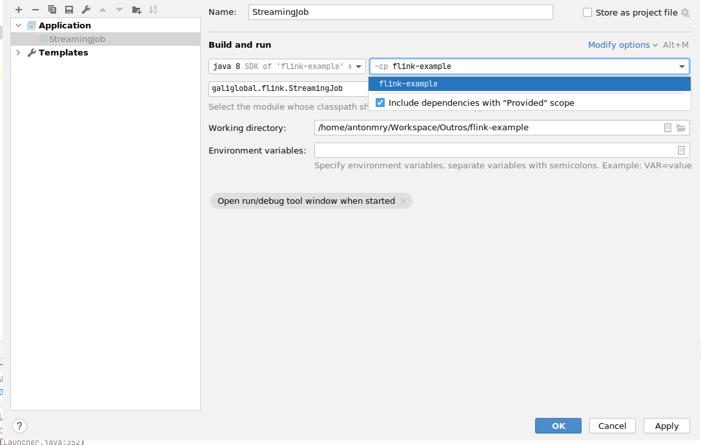
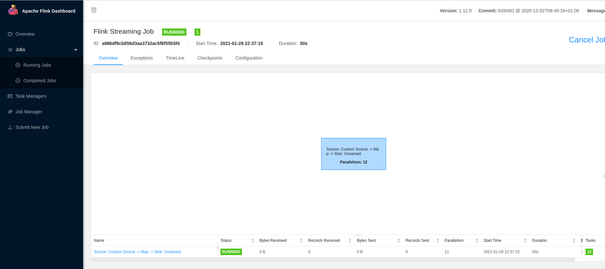
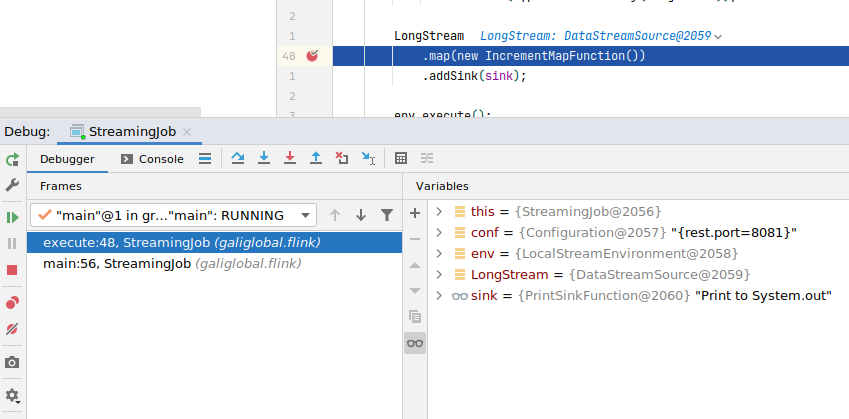
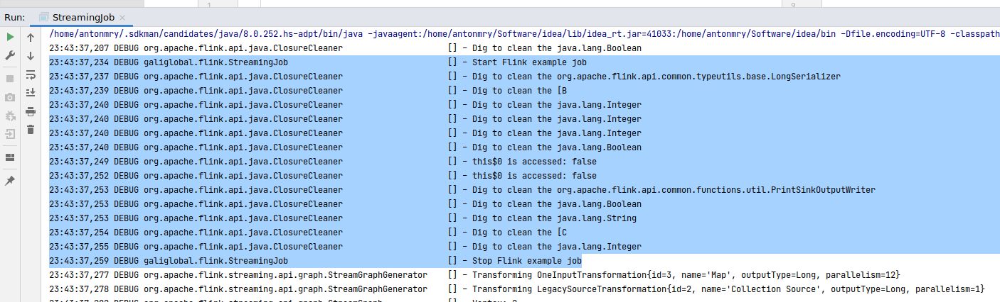

title=Flink setup for development
date=2021-01-31
type=post
tags=Flink
status=published
~~~~~~

## Introduction

Start to work with a new technology is always a challenge. Even if there is
a good [Getting Started] or a great (and free) [Hands-on Training], there are
always questions about how to start, how to debug problems or how to launch the
project in your IDE. In this article, I summarize some of the notes I've been
writing since I started with Flink.

## Install Flink

The first step is to install Flink. This is really straightforward, just go
to the Flink download page and download it:

```sh
wget https://archive.apache.org/dist/flink/flink-1.12.0/flink-1.12.0-bin-scala_2.12.tgz
tar -zxvf flink-1.12.0-bin-scala_2.12.tgz
```

And start the cluster:

```sh
./flink-1.12.0/bin/start-cluster.sh
```

You can access the [Flink Web Dashboard] in your browser.

We aren't going to need it initially so it's better to stop it:

```sh
./flink-1.12.0/bin/stop-cluster.sh
```

## Bootstrap a Flink job

To bootstrap the project, just execute the following Maven command:

```sh
mvn archetype:generate                               \
    -DarchetypeGroupId=org.apache.flink \
    -DarchetypeArtifactId=flink-quickstart-java \
    -DarchetypeVersion=1.12.0 \
    -DgroupId=galiglobal \
    -DartifactId=flink-example \
    -Dversion=0.1 \
    -Dpackage=galiglobal.flink \
    -DinteractiveMode=false

cd flink-example
```

The structure of the project is quite simple:

```
.
├── pom.xml
└── src
    └── main
        ├── java
        │   └── galiglobal
        │       └── flink
        │           ├── BatchJob.java
        │           └── StreamingJob.java
        └── resources
            └── log4j2.properties
```

We are going to focus only on `StreamingJob.java`.

## Import and run the job in IntelliJ IDEA

We are going only to cover my favourite Java IDE. Other IDEs should work in a
similar way. First of all, import in the IDE as maven project. You can do it
easily from the command-line.

```sh
idea pom.xml
```

You can go to `StreamingJob.java` and execute it as a normal Java application
using the Shift+F10 shortcut on Linux/Windows. An error like this is showed
in the output:

> Exception in thread "main" java.lang.NoClassDefFoundError: org/apache/flink/streaming/api/environment/StreamExecutionEnvironment
> 	at galiglobal.flink.StreamingJob.main(StreamingJob.java:39)
> Caused by: java.lang.ClassNotFoundException: org.apache.flink.streaming.api.environment.StreamExecutionEnvironment
> 	at java.net.URLClassLoader.findClass(URLClassLoader.java:382)
> 	at java.lang.ClassLoader.loadClass(ClassLoader.java:418)
> 	at sun.misc.Launcher$AppClassLoader.loadClass(Launcher.java:352)
> 	at java.lang.ClassLoader.loadClass(ClassLoader.java:351)
> 	... 1 more

Some dependencies are missing. To solve it, go to `Run` -> `Edit Configuration` ->
`Modify options` -> `Use classpath of module` and in the new field, mark
`Include dependencies with "Provided" scope`.



Re-run the job and a new error appears:

> Exception in thread "main" java.lang.IllegalStateException: No operators defined in streaming topology. Cannot execute.
> 	at org.apache.flink.streaming.api.environment.StreamExecutionEnvironment.getStreamGraphGenerator(StreamExecutionEnvironment.java:2000)
> 	at org.apache.flink.streaming.api.environment.StreamExecutionEnvironment.getStreamGraph(StreamExecutionEnvironment.java:1991)
> 	at org.apache.flink.streaming.api.environment.StreamExecutionEnvironment.getStreamGraph(StreamExecutionEnvironment.java:1976)
> 	at org.apache.flink.streaming.api.environment.StreamExecutionEnvironment.execute(StreamExecutionEnvironment.java:1822)
> 	at galiglobal.flink.StreamingJob.main(StreamingJob.java:62)

## Develop our first Flink job

Let's add a new Java class to our project called `RandomLongSource`:

```java
public class RandomLongSource extends RichParallelSourceFunction<Long> {

    private volatile boolean cancelled = false;
    private Random random;

    @Override
    public void open(Configuration parameters) throws Exception {
        super.open(parameters);
        random = new Random();
    }

    @Override
    public void run(SourceContext<Long> ctx) throws Exception {
        while (!cancelled) {
            Long nextLong = random.nextLong();
            synchronized (ctx.getCheckpointLock()) {
                ctx.collect(nextLong);
            }
        }
    }

    @Override
    public void cancel() {
        cancelled = true;
    }
}
```

This class is just generating an infinite series of long numbers to feed our
job.

Let's modify now `StreamingJob.java` to process it and print the result:

```java
public class StreamingJob {
    private SourceFunction<Long> source;
    private SinkFunction<Long> sink;

    public StreamingJob(SourceFunction<Long> source, SinkFunction<Long> sink) {
        this.source = source;
        this.sink = sink;
    }

    public void execute() throws Exception {
        StreamExecutionEnvironment env = StreamExecutionEnvironment.getExecutionEnvironment();

        DataStream<Long> LongStream =
            env.addSource(source)
                .returns(TypeInformation.of(Long.class));

        LongStream
            .map(new IncrementMapFunction())
            .addSink(sink);

        env.execute();
    }

    public static void main(String[] args) throws Exception {
        StreamingJob job = new StreamingJob(new RandomLongSource(), new PrintSinkFunction<>());
        job.execute();
    }

    public class IncrementMapFunction implements MapFunction<Long, Long> {

        @Override
        public Long map(Long record) throws Exception {
            return record + 1;
        }
    }
}
```

Note: this code is from this [StackOverflow answer](https://stackoverflow.com/questions/61458182/flink-streaming-example-that-generates-its-own-data).

If you execute it, you will see an infinite list of long numbers:

> ...
> 3> 3869376031196493001
> 12> 4265560998598976840
> 12> -7434045225389162179
> 1> 3964290136030554255
> 1> 8881056576399978883
> ...

Note: The 3>, 12>, 1> indicate which sub-task (i.e., thread) produced the
output.

This is one of the most surprising things for Flink beginners: you don't need
a cluster to develop a Flink job, you can easily do it locally from your IDE
and it works quite well.

There are some minor differences. For example, to access the [Flink Web
Dashboard] you will need to add the following dependency to maven:

```xml
<dependency>
	<groupId>org.apache.flink</groupId>
	<artifactId>flink-runtime-web_2.11</artifactId>
	<version>${flink.version}</version>
</dependency>
```

And modify the `env` variable with the following code:

```java
Configuration conf = new Configuration();
StreamExecutionEnvironment env = StreamExecutionEnvironment.createLocalEnvironmentWithWebUI(conf);
```

Note: credit goes to this [StackOverflow answer](https://stackoverflow.com/questions/46988499/flink-webui-when-running-from-ide).

Re-run the job and you should be able to access the [Flink Web Dashboard] and
see your job running:



## Debug with breakpoints

One of the nice things it's be able to debug your Flink job [using breakpoints]
as usual.



## Monitoring

Let's add some proper logging to our job. First of all, add the following
field to `StreamingJob.java`:

```java
private static final Logger LOG = LoggerFactory.getLogger(StreamingJob.class);
```

Let's delete the longStream variable and create a new one:

```java
LOG.debug("Start Flink example job");

DataStreamSink<Long> logTestStream = env.fromElements(0L, 1L, 2L)
    .map(new IncrementMapFunction())
    .addSink(sink);

LOG.debug("Stop Flink example job");
```

Modify `src/main/resources/log4j2.properties` to use the DEBUG log level:

```
rootLogger.level = DEBUG
```

Re-run the job and you should see the new log traces:



When running the job locally, the log level is quite verbose and it may be hard
to find your own messages between the Flink messages. Let's configure that. Edit
`src/main/resources/log4j2.properties` again to add the following lines:

```
logger.flink.name = org.apache.flink
logger.flink.level = warn
```

Re-run the job and you should only see the proper logs messages.

## Run and monitoring in the cluster

Once we are done with our job, we can deploy it in a local cluster. The first
step is to start the cluster again:

```sh
./flink-1.12.0/bin/start-cluster.sh
```

Compile our job:

```sh
mvn clean package -Pbuild-jar
```

## Metrics?

TODO

## Tests

TODO

## Summary and next steps


Did I miss something? You can comment on [GitHub] or just drop me a note on
[Twitter]!

[Getting Started]: https://ci.apache.org/projects/flink/flink-docs-release-1.12/try-flink/local_installation.html
[Hands-on Training]:https://ci.apache.org/projects/flink/flink-docs-release-1.12/learn-flink/
[Flink Web Dashboard]: http://localhost:8081/
[GitHub]: https://github.com/antonmry/galiglobal/pull/37
[Twitter]: https://twitter.com/antonmry
[using breakpoints]: https://www.jetbrains.com/help/idea/using-breakpoints.html

