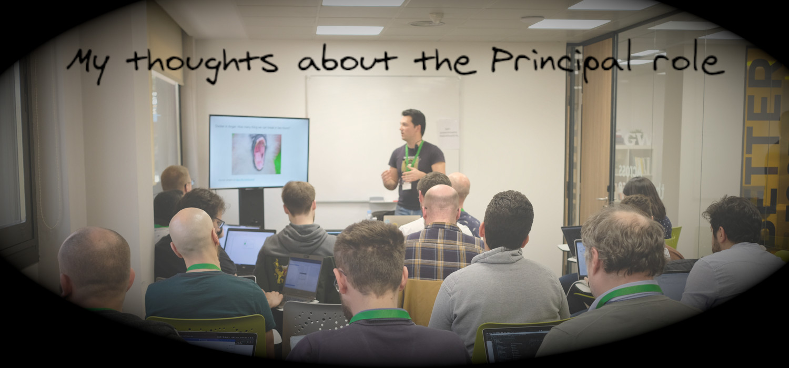

title=How to retain great engineers? A technical approach
date=2021-06-04
type=post
tags=Career
status=published
---------

## The problem

We all know it: it sucks when a good colleague leave the company. At the same
time, the pandemic and the proliferation of the remote work has made even more
usual and easier to leave a job in our sector. This has important drawbacks for
companies:

- There are less know-how in the company. People who built the system initially
  are gone and new engineers don't know why things are as they are.
- Engineers leave the company before they start to be fully productive. It
  applies to everybody but it's even more important with senior roles because
  they usually need more time to have the global picture in mind. It's a huge
  waste of money.
- The managers approach to minimize the impact: raise salaries and make easier
  to promote. As consequence, you can become a senior engineer just jumping
  between jobs without putting anything in production in any of them.

In general, this situation leads to huge technical debt and frustration.

## A technical approach?

This isn't a technical problem, it's a people problem. So you can expect
managers, directors and HR departments working on solve it. But it doesn't seem
they are succeeding: the situation is becoming worse and worse. The thing is,
as engineer, I can't ignore this problem: the technical impact is huge. So
I started to think what I can do as technical leader to solve it, or at least,
to minimize it.

If you have been in the industry for a while, you already know the most complex
problems are always related to people. It doesn't matter your role. In the end,
behind a hard technical problem there is always persons. This isn't different.

A word of caution is needed: nothing of this has been tested or is based in my
personal experiences. This is a exercise of how I would do it if I was the
person in charge. I am not. Yet I think it's a good exercise for any senior
technical role out there. When choosing a solution, technology, etc., it's
important to take in account some of these things. Sometimes the best technical
solution isn't the right one because it generates friction. This is the same
thing in a bigger scale.

## Reduce complexity and technical debt

My first step to retain engineers is to reduce technical debt and complexity.
We want our systems to run smoothly and easy to work with them. This is pretty
obvious but it's really hard to achieve. The idea here is to stablish some
clear guidelines to do that.

First, don't create your own solutions. It almost never ends well. Engineers
start super motivated when it's a green field but as soon as it growths in
complexity, the process becomes more and more frustrating. So don't create software in
the first place is the best approach. How to do it? Use open software for
everything.

## Conclusions

Leave a comment on [GitHub] or just drop me a message on [Twitter], I'm always
open to have a chat about the role or share my experiences.

[GitHub]: https://github.com/antonmry/galiglobal/pull/40
[Twitter]: https://twitter.com/antonmry

